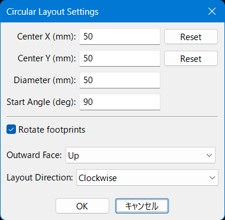

# KiCad 円形配置プラグイン

KiCadで選択したフットプリントを円形に配置するための、高機能なプラグインです。

## 機能

*   **円形配置:** 選択した2つ以上のフットプリントを円周上に均等に配置します。
*   **レイアウトのカスタマイズ:**
    *   円の**直径**を設定できます。
    *   フットプリントを円周上の角度に合わせて**回転させる**かを選択できます。
    *   フットプリントの**正面の向き**を選択できます。各フットプリントのどの面を円の外側に向けるかを指定します。

| Right | Up |
|:---:|:---:|
| フットプリントの右側が円の外側を向きます。 | フットプリントの上側が円の外側を向きます。 |
|  |  |
| **Left** | **Down** |
| フットプリントの左側が円の外側を向きます。 | フットプリントの下側が円の外側を向きます。 |
|  |  |

*   **正確な中心点制御:**
    *   円の中心は、選択したフットプリントの平均位置から自動的に計算されます。
    *   **中心点のX座標とY座標**を手動で編集し、正確な位置を指定できます。
    *   **リセットボタン**で、中心座標を計算された初期値に個別にリセットできます。
*   **設定の永続化:**
    *   ダイアログの設定（直径、回転、向き、中心点）は、**PCBファイルごとに自動的に保存**されます。
    *   ダイアログの最後の**画面上の位置も記憶**され、次回は同じ場所に表示されます。

## 使用例

| 配置前 | 配置後 |
|:---:|:---:|
|  |  |

## 使い方

1.  Pcbnewで、配置したい**フットプリントを2つ以上選択**します。
2.  トップツールバーの**円形配置アイコン** () をクリックするか、**ツール -> 外部プラグイン -> Circular Layout** に進みます。
3.  表示されたダイアログで設定を調整します。
    *   中心座標は選択範囲の中心点で初期化されますが、必要に応じて編集できます。
    *   「リセット」ボタンで、中心座標を計算値に戻せます。
4.  **OK**をクリックします。選択されたフットプリントが再配置されます。フットプリントは、配置される前にリファレンス（例: R1, R2, R10）でソートされます。

## インストール方法

手動でこのプラグインをインストールできます。

1.  プラグイン＆コンテンツマネージャーを開き、**ファイルからインストール** を選択します。
2.  このリポジトリ内のZIPファイル(**kicad-circular-layout.zip**)を使用します。
3.  KiCadを再起動します。Pcbnewのツールバーにプラグインのアイコンが表示されます。

## ライセンス

このプロジェクトはMITライセンスです。
